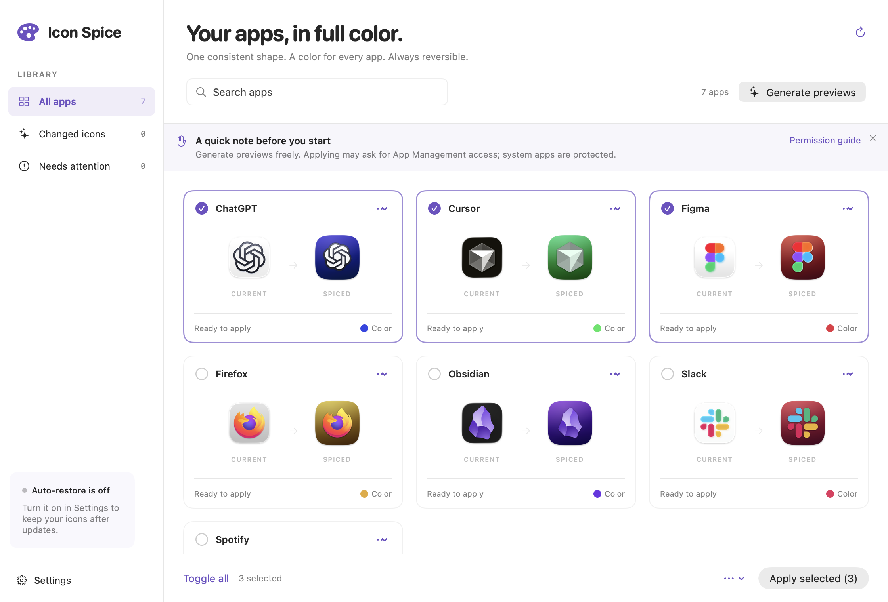

# Icon Spice

A native macOS menu bar app that gives your apps vivid, consistent icons. It generates icons from the apps’ existing artwork, previews every change, and keeps restore points so you can go back.



## Run it

Requires macOS 14 or newer and Swift 6.2 or newer (Xcode 26+). macOS 14 is a provisional deployment target; this first build is tested on macOS 26.5.2.

```sh
./scripts/build-app.sh --debug
open "dist/Icon Spice.app"
```

Opening the app shows its library window, Dock icon, and normal macOS application menu. Quit with **⌘Q**, **Icon Spice → Quit Icon Spice**, or the **Quit Icon Spice** button below Settings in the library sidebar. Closing the library keeps Icon Spice running in the menu bar and hides its Dock icon; open the app again or choose **Open Icon Spice** from the palette menu to bring it back.

For an optimized build, omit `--debug`. Open `Package.swift` in Xcode to work on the project. Run the `MacIconSpice` scheme for the UI or `iconspice` for the command line.

1. Click the palette in the menu bar to open the library.
2. Generate previews. Nothing is applied during generation.
3. Select the apps you like and choose **Apply selected**.
4. If macOS prompts for App Management, allow access. Settings links to the relevant pane when a change fails.
5. Enable **Restore saved icons after app updates** in Settings. The watcher runs while Icon Spice is open; enable launch at login to keep it running.

Use an app card’s menu to change its color, import a replacement, export a PNG, or restore its original icon. The batch menu restores selected or all tracked icons. Existing custom icons are backed up before the first change. **Refresh Dock** is explicit because it restarts the Dock.

System apps appear as protected and are skipped. Full Disk Access may help with restricted locations; Icon Spice does not bypass SIP or use a privileged helper. For macOS’s Clear or Tinted icon appearance, try Default if your generated colors are obscured. Tahoe appearance behavior and older macOS versions still need testing on actual devices.

## Command line

The build places a standalone CLI at `dist/iconspice` and a copy inside the app’s Resources. CLI and UI use the same core and restore store.

```sh
dist/iconspice scan
dist/iconspice scan --json
dist/iconspice generate com.apple.TextEdit --output /tmp/spiced-icons --hue 280
dist/iconspice status --json

# These commands change icons of the specified installed apps:
dist/iconspice apply com.example.YourApp --hue 280
dist/iconspice revert com.example.YourApp
dist/iconspice revert --all
dist/iconspice reapply --refresh-dock
```

Hue is in degrees at the CLI boundary and a unit fraction inside the library. `generate` exports a 1024 px PNG and a multi-resolution ICNS; it never applies the output. Dock refresh is opt-in on mutation commands. Errors return a nonzero status; usage errors return 2. When multiple copies of an app share a bundle ID, the CLI resolves the first scanned copy; use the UI to choose a specific path.

## Optional AI

The local algorithmic generator is the default and requires no network or API key. To use AI, save your OpenAI API key in Settings, select apps, then choose **Generate selected with AI…** from the batch menu. You can also choose **Customize with AI…** from one app’s card menu.

The AI sheet has a **What would you like to change?** field. Ask for a specific change, such as “Use a teal background and a brighter white glyph. Keep the logo’s shape.” Choose **Original icon** to start fresh, optionally leaving the instruction blank to use the shared style, or **Current preview** to refine an existing generated icon with your instruction. A current-preview edit uses that preview as its image input, preserves unspecified details, and keeps the original artwork in the restore store. One instruction applies to all listed apps; the sheet shows the icons and explains what is sent before you confirm. Images are still previews until you apply them.

Customization starts with an editable default that requests crisp vector shapes, preserved logo details and colors, mostly flat backgrounds, a few geometric accents, selective subtle gradients, and minimal glow. **Default style** restores this prompt after you edit it. Your edits stay in the field while the app is running.

The key is stored only in macOS Keychain under `com.iconspice.openai`, never in JSON, logs, or image exports. The first provider is OpenAI’s image-edit API with a pinned model and style prompt (see `OpenAIIconGenerator.model`). Provider charges and model availability depend on your OpenAI account. AI results are cached by bundle ID, input artwork, color, model, style, and your instruction. Changing the instruction or the preview input generates a separate result. A failed refinement keeps your previous preview and reports the error. When starting from the original artwork, a failed request falls back to a local preview without the requested AI changes. Automatic restore reuses the saved AI image and makes **no network calls**, even when an app updates; explicitly generate again to refresh its artwork.

## How it works

`IconSpiceCore` has five main parts: scanner, generator, applier, mapping store, and watcher. `IconWorkflow` orchestrates them for both entry points. Public boundaries use `Sendable` structs, enums, and the `IconGenerating` protocol; the package compiles in Swift 6 language mode.

Source loading prefers bundled ICNS/assets. The local generator removes simple enclosing backgrounds, chooses a dominant saturated hue, recolors monochrome symbols, and composites the artwork onto a continuous squircle with a gradient and glow. Monochrome apps without a usable accent get a stable bundle-ID hue. This is a heuristic; detailed or unusual artwork may benefit from a color override or an imported icon. The card menu links to macOSicons.com as an optional manual source.

Custom icons are applied with the public `NSWorkspace.setIcon` API. A two-phase transaction writes images and backups before touching an app, then commits the mapping after success. Mapping writes are atomic and file-locked; a separate mutation lease prevents CLI/UI races. Failed commits attempt to restore the previous icon. Revert removes a record only after restoration succeeds. Bundle identity is checked before mutations, so a different app replacing a tracked path is not changed.

The FSEvents watcher debounces app changes, checks the original artwork’s hash, and regenerates local icons when artwork changes. A cached image is reapplied when the custom-icon flag disappears. Watcher snapshots cannot resurrect a record concurrently reverted by the CLI. Moved apps keep the old path’s record; restore/reapply targets tracked paths, and you can apply at the new path after rescanning.

Data stays in `~/Library/Application Support/IconSpice/` (mapping and restore assets) and `~/Library/Caches/com.iconspice/AI/` (AI images). Keep the restore assets until you’ve reverted your icons. A corrupt mapping is reported and left intact.

## Validate

```sh
swift test
./scripts/build-app.sh
```

Tests cover deterministic generation, monochrome fallback, background removal, all ICNS sizes, source loading, scanning, persistence, concurrent stores, identity checks, AI caching/errors, and real apply/revert on disposable temporary app bundles. They do not call a paid provider or modify installed apps.

Window tests also cover presentation, Dock visibility while open or minimized, closing and reopening the retained library, and the native application's Quit/Settings menu actions. To check that the packaged app actually shows a library on screen with its Dock/application-menu presence enabled:

```sh
open "dist/Icon Spice.app"
swift scripts/check-app-window.swift
```

## Release

Local builds are ad hoc signed. For distribution, use a Developer ID Application certificate and saved `notarytool` profile:

```sh
SIGNING_IDENTITY="Developer ID Application: Your Name (TEAMID)" \
NOTARY_PROFILE="your-notary-profile" ./scripts/notarize.sh
```

The script creates a universal app, notarizes and staples it, and produces a ZIP and SHA-256. Publishing a GitHub release and Homebrew cask needs a public repository/release URL; neither is published by this scaffold. See [release checklist](docs/RELEASE.md).

## License and credit

MIT. Applying/restore research and the custom-icon flag check were informed by [Bengerthelorf/macIconChanger](https://github.com/Bengerthelorf/macIconChanger). Its exact MIT notice is retained in [ThirdParty/macIconChanger/LICENSE](ThirdParty/macIconChanger/LICENSE). See [upstream analysis](docs/UPSTREAM.md) for the inspected revision and which implementation choices differ.
